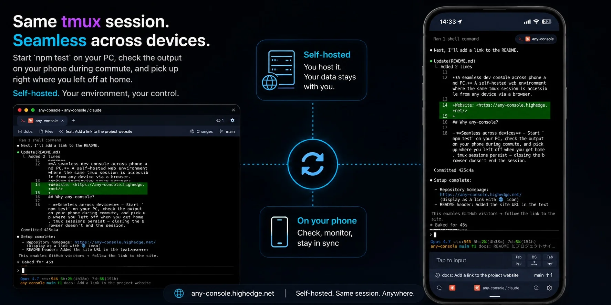

# any-console

[](https://github.com/kt0319/any-console/releases/latest)
[](https://github.com/kt0319/any-console/commits/main)
[](https://github.com/kt0319/any-console/actions/workflows/ci.yml)
[](https://codecov.io/gh/kt0319/any-console)
[](LICENSE)
[](https://www.rust-lang.org/)
[](https://vuejs.org/)

<p align="center">
  
</p>

**A seamless dev console across phone and PC.** A self-hosted web environment where the same tmux session is accessible from any device via a browser.

Website: <https://any-console.highedge.net/>

## Why any-console?

- **Seamless across devices** — Start `npm test` on your PC, check the output on your phone during commute, and pick up where you left off when you get home. tmux sessions persist — closing the browser doesn't end the session.
- **Serious mobile input** — A custom virtual keyboard with flick input. Practical enough to run `git commit` from your phone.
- **Jobs, Git, and terminal in one place** — No tab-switching between tools. Run scripts, commit, and push — all in one tap.

## Features

- **Persistent sessions** — tmux × WebSocket; switch devices without losing your session
- **Mobile-optimized input** — Custom flick keyboard with swipe support
- **Web terminal** — xterm.js based, multi-tab and split-pane
- **Git UI** — Branch switching, commit, push/pull, diff, history, stash, merge/rebase
- **Job runner** — One-tap shell script execution; define and edit jobs from the UI
- **PWA** — Installable on phone and desktop
- **Lightweight stack** — Vue 3 + Pinia frontend (Vite), Rust (axum) backend

## Platform support

**Client side: any OS, any device with a modern browser.** This is the whole point of any-console — open `https://<your-host>/` from your phone, laptop, or any browser and you get the full UI.

**Host (server) side: Linux or macOS for real use.** The runtime is POSIX-portable. Service management is platform-native — `systemd` on Linux, `launchd` on macOS — and `tmux` provides persistent sessions on both. The `./any-console` helper detects the OS and drives the right service manager.

| Host setup | Platforms | Status |
|------------|-----------|--------|
| **systemd** (first-class) | Linux | Supported. Daily-use target. |
| **launchd** (first-class) | macOS | Supported. Ideal for an always-on Mac (e.g. a Mac mini server). |

A first-class host needs Linux or macOS. Browser access from any OS (macOS / Windows / iOS / Android) is fully supported and is the intended client experience.

> **macOS note:** an always-on Mac mini / Mac Studio is the sweet spot. The `launchd` service is registered as a user `LaunchAgent`, so it starts at login — enable automatic login (System Settings → Users & Groups) if the Mac runs headless. A MacBook that sleeps or travels is a poor fit for the "check from your phone while away" use case.
>
> **Keep the Mac awake.** macOS sleeps by default, and Tailscale cannot wake a sleeping Mac — while asleep the server is unreachable, and the burst of timeouts right after wake-up causes flaky sessions and reconnect storms. On a server Mac, disable system sleep:
>
> ```bash
> sudo pmset -a sleep 0 disksleep 0
> ```
>
> (Display sleep is fine to keep. Verify with `pmset -g` — `sleep` should be `0`.)

## Setup

Downloads a prebuilt release from [GitHub Releases](https://github.com/kt0319/any-console/releases) into `~/.any-console` and runs a non-interactive setup. No Rust/Node toolchain needed — only `git` and `tmux` at runtime:

```bash
curl -fsSL https://raw.githubusercontent.com/kt0319/any-console/main/install.sh | bash
```

Then finish service registration interactively — this registers a systemd (Linux) or launchd (macOS) service; the `./any-console` helper detects the OS. Your SSH keys, git/gh config, and shell environment all carry over; tmux sessions persist across reboots:

```bash
cd ~/.any-console && ./any-console setup
```

For a headless Mac mini, enable automatic login and disable system sleep (see the macOS note above). After this, manage the service with `./any-console start|stop|update|logs|...` (see [Commands](#commands)).

To update later, just re-run the `curl | bash` command above — it's idempotent and leaves `data/`, `config.json`, and `certs/` untouched. `./any-console update` does the same thing: it downloads the latest release with checksum verification, replaces the binary atomically, and restarts the service if one is registered.

### Requirements

- `git` — used by the Git UI
- `tmux` — required for terminal session management
- `gh` (GitHub CLI, optional) — for fetching GitHub repos, issues, PRs, and Actions

## Authentication

> **Read [SECURITY.md](SECURITY.md) before deploying.** any-console gives the browser full shell access to the host — the token must be treated like an SSH key, and the app must never be exposed to the public internet.

- On first start, if `data/auth.json` does not exist, a random 32-character token is generated and saved automatically.
- The token is printed to the startup log once (stdout / journalctl / `logs/any-console.log`). Open the app URL on your device and sign in with it — the device gets a revocable cookie, so you only enter the token once per device.
- On subsequent starts, `data/auth.json` is never overwritten.
- The token can be changed from the "Security" settings in the UI.

### Adding a new device with a QR code

Once one device is signed in, you can add another (e.g. add your iPhone from your already-authenticated laptop) without typing the token:

1. On the signed-in device, open Settings > Auth and tap "Add new device" (on a desktop-sized screen with no phone paired yet, a one-time "Open on your phone" shortcut also appears on the empty-state screen).
2. Scan the QR code with the new device's camera app.
3. The new device opens the link, signs in automatically, and lands on the normal app screen.

The QR code encodes a one-time link that expires in 90 seconds and can only be used once — if it expires or was already used, the new device falls back to the normal token entry screen. See [docs/DECISIONS.md](docs/DECISIONS.md) (ADR 28) for the security rationale.

### Disabling authentication for local development

Authentication can be disabled only with `ANY_CONSOLE_DISABLE_AUTH=1` in the server process environment. This is intended for disposable local development and tests, not managed services or closed-network production use. For normal Tailscale deployments, keep token + device-cookie authentication enabled.

## Agent hooks (optional)

Terminal sessions running known coding agents (Claude Code, Codex, ...) get automatic
working / idle / blocked state detection out of the box via screen analysis.
For Claude Code you can optionally enable hook-based reporting, which is more
accurate and instant (no polling delay, no dependency on screen rendering).

```bash
./any-console hooks-setup
```

This registers the shipped `scripts/claude-code-hook.sh` in `~/.claude/settings.json`
for all relevant events (PreToolUse / PostToolUse / UserPromptSubmit / PreCompact /
Notification / Stop / SessionEnd). It merges into your existing hooks config —
other hooks you already have are left untouched — and re-running it is a no-op
if already installed. A `.bak` copy of the previous `settings.json` is kept.

The script only acts inside sessions created by any-console (connection info is
injected as environment variables) and always exits 0, so it never interferes
with Claude Code itself. Hook-reported state expires after a few minutes of
silence and detection falls back to screen analysis automatically.

## Dispatch API

`POST /dispatch` lets external tools (CI, automation, scripts) launch or send text to a workspace session over HTTP, without opening the UI.

If any-console is only reachable via its `.ts.net` address (the default with Tailscale Serve, see [HTTPS](#https) below), the caller must be on the same tailnet — a hosted CI runner isn't by default. For GitHub Actions, add a step with [`tailscale/github-action`](https://github.com/tailscale/tailscale-github-action) (OAuth client credentials in Secrets, scoped via a Tailscale ACL tag) before the `curl` step. See `.github/workflows/dispatch-on-ci-failure.yml` for a working example.

```bash
curl -X POST https://<your-device>.ts.net/dispatch \
  -H "Authorization: Bearer <token>" \
  -H "Content-Type: application/json" \
  -d '{
    "workspace": "my-project",
    "job": "terminal",
    "text": "npm run build\n"
  }'
```

The request always waits in an approval queue — open it from Settings > Dispatches, or via a push notification if enabled. Only after a human approves does the text actually get sent. The old `"direct": true` immediate-execution mode is no longer supported.

Key fields on the request body (`server/src/dispatch.rs`):

| Field | Description |
|---|---|
| `workspace` | Workspace ID or display name to target |
| `job` | Job key to launch (default: `terminal`) |
| `text` | Text to send to the session (e.g. a shell command) |
| `branch` | Checkout this branch before running (rejected with 400 if the workspace has uncommitted changes and the branch differs from the current one) |
| `dedup_key` | Opaque string; a new request with the same key replaces the still-pending one instead of queuing a duplicate (useful for repeated CI-failure dispatches) |

For CI/automation, use a **scoped dispatch token** instead of your main token — create one from Settings > Auth > API Tokens. It can only queue dispatch requests and cannot approve queue items or access anything else, so a leaked CI secret can't be used to run arbitrary commands on its own.

## HTTPS

PWA installation and service workers require HTTPS.

**Tailscale Serve** is the easiest option — it handles certificates automatically:

```bash
tailscale serve --bg / proxy http://127.0.0.1:8888
```

Access the app at `https://<your-device>.ts.net/`.

The any-console server itself listens over HTTP. If you need another HTTPS setup, put a reverse proxy such as Caddy or nginx in front of `http://127.0.0.1:8888`.

Direct-port dev server previews can still use HTTPS. `./any-console https-setup` issues a Tailscale certificate and stores it for the preview proxy, so URLs such as `https://<device>:12001/` can work even when the main app is served through Tailscale Serve:

```bash
./any-console https-setup
```

This does not make the main any-console port HTTPS. It only provides certificates to the preview proxy. Tailscale certificates expire after ~90 days — re-run the command to renew.

The default port is 8888. To change it, set `__global__.port` in `config.json`.

## Commands

For the systemd (Linux) and launchd (macOS) setups, all operations go through the `./any-console` command, which detects the OS and drives the right service manager.

```
./any-console setup        First-time setup (register service)
./any-console update       Update to the latest release (checksum-verified download)
./any-console start        Start the service          (systemctl / launchctl)
./any-console stop         Stop the service           (systemctl / launchctl)
./any-console restart      Restart the service        (systemctl / launchctl)
./any-console status       Show status (service state, URL, version)
./any-console logs         Show service logs          (journalctl / log file)
./any-console run          Run in foreground (no service; any OS)
./any-console https-setup  Issue / renew a Tailscale cert for direct-port dev previews
./any-console uninstall    Remove the service registration, optionally clean up files
./any-console version      Show version
```

`run` skips the service manager entirely and starts the server binary directly in the foreground. Useful for WSL or for quick test runs without registering a service.

### Updating

```bash
./any-console update
```

Delegates to `install.sh`: checksum-verified download, atomic binary replacement, and a service restart when one is registered. It's a no-op when you're already on the latest release.

Upgrade compatibility note: legacy-migration code for versions prior to 2026-06 has been removed — `config.json` files keyed by workspace display name are no longer rewritten to ID keys (they still load, but new installs always use ID keys), and leftover grouped tmux sessions (`acg-*` / `ac-*__c*`) from the pre-2026-06 terminal architecture are no longer cleaned up at startup. When upgrading from such an old version, kill those stale tmux sessions manually (`tmux kill-session -t <name>`) if any remain.

## Repository layout

```
server/           Backend (Rust, axum)
ui/                Frontend (Vue 3 + Pinia, built with Vite)
agent_manifests/   Vendored agent-detection manifests (read by the backend at runtime)
docs/              Architecture & design docs
```

See [docs/ARCHITECTURE.md](docs/ARCHITECTURE.md) for the module-level breakdown.

## Configuration

- Workspace settings (icons, job definitions, links, etc.) are stored in `config.json`.
- Generated automatically on first run. To configure manually, copy `config.json.example` and edit it.
- Export/import is available from the settings modal.

## Project Stance

any-console started as a tool built for daily real-world use, and it stays close
to that origin: pragmatic, opinionated, and focused on what actually gets used.

- **Issues and PRs are welcome.** Responses may take a while, but they are read.
- **The project has a clear design philosophy** (see `CLAUDE.md`). Contributions
  that fit that direction are the easiest to land; ones that pull elsewhere may
  work better as a fork — that is the spirit of MIT.
- **Releases come when they're ready.** A quiet month does not mean the project is
  abandoned.
- **The roadmap is lightweight.** Features land as they prove useful in practice.

If that sounds good to you, welcome aboard.

## License

[MIT](LICENSE)
